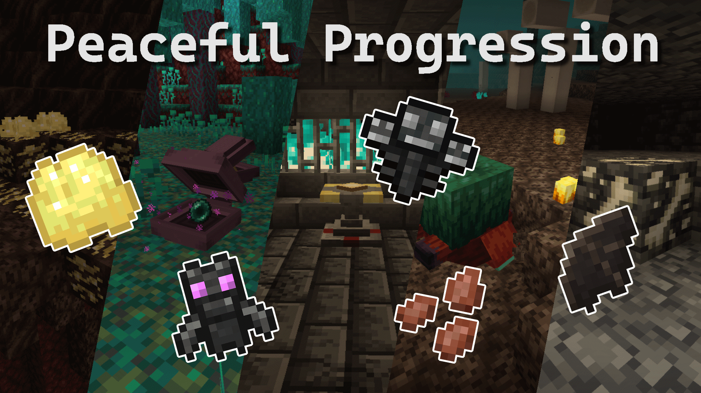

# Peaceful Progression

Makes blocks/items/dimensions available in Peaceful difficulty that normally require mob drops in vanilla by adding new ores, crops, mobs, structures, trades, and behaviors. This enables most progression to be completed in Peaceful, including getting an Elytra from the End islands and crafting beacons. Enables hunger in peaceful with no negative effects (purely cosmetic).

Adds new methods to acquire the following drops: Gunpowder, saddles, bones, blaze rods, breeze rods, ender pearls, froglights, slime balls, resin, phantom membranes, ghast tears, string, spider eyes, mob heads, prismarine shards, prismarine crystals, tide armor trim smithing template, nether stars, tridents, nautilus shells, wither roses, rotten flesh, trial keys, dragon egg/breath, ominous bottles, and more.

## Developers

- **xen_42** – Lead developer. Started the mod, designed and implemented all core features, and created all original assets and artwork.
- **MegaPiggy** – Co-developer. Joined later, named the mod, made hardcoded systems data-driven, backported all the way to 1.20.1, and helps with updates.

## Features:

- Bats can be lured and bred with watermelon. They drop bat wings on death, and randomly drop guano.
- Sniffers have a vastly increased loot pool and can dig up new/existing items from soul sand/soil, sand, and gravel.
- New mob: **Enderclams**. Spawn in warped forests and the End. Drop ender pearls and clam meat.
- New mob: **Wisps**. Spawn in Nether Fortresses, can be duplicated with brimstone, drop ectoplasm, and produce ghast tears when fed guano.
- Re-enables hunger in Peaceful. This can be customized with the `enableStarvingPeaceful` and `enableSuperHealingPeaceful` game rules.
- New ore: **Fossils**. Spawn in the Overworld and Nether. Drop bone meal and can be brushed to obtain bones.
- New ore: **Brimstone**. Spawns in soul soil.
- New plant: **Flax**. Grows in plains and drops string. Its seeds are edible. Can also spawn when bone meal is used on grass blocks.
- New plant: **Blaze Coral**. Dug up by Sniffers from soul soil/sand and smelted into blaze rods.
- New plant: **Breeze Coral**. Dug up by Sniffers from gravel and smelted into breeze rods.
- New crafting recipes for gunpowder, saddles, phantom membranes, and rotten flesh.
- New generated structure: **Effigy Altar Dungeon**. Level 2 cartographers sell a map to help locate one.
- New crafting table: **Effigy Altar**. Used to craft Totems of Undying and boss effigies.
- New items: **Dragon Effigy, Elder Effigy, Wither Effigy, and Raid Effigy**. Using them grants boss drops.
  - Dragon Effigies open End island portals when used in the End.
  - Using a Dragon Effigy on a cauldron fills it with dragon breath.
- New equipment: **Cape**, a lesser version of the Elytra that doesn't allow firework boosts.
- New villager: **Musician**. Sells music discs, horns, bells, jukeboxes, note blocks, Tears, and Lava Chicken. Uses a jukebox as its workstation.
- New village structure: **DJ House**, which rarely generates in villages.
- Frogs can eat dropped magma cream items to produce froglights while in the Nether.
- New villager trades:
  - Clerics sell spider eyes.
  - Farmers buy flax.
  - Leatherworkers buy bat wings.
  - Cartographer sell maps to Effigy Altar Dungeons, Ocean Ruins, and Trail Ruins.
  - Wandering traders sell mob heads and trial keys.
- Panda sneeze slime-drop probability is increased from 1/700 to 1/3. Pandas can also be brushed to make them sneeze (whether by hand or by dispenser).
- Stripping pale oak logs drops resin.
- Mob heads can be found in dungeons and Effigy Altar Dungeon chests.
- Added prismarine and tridents to ocean ruin loot pools, along with a cartographer trade to help locate them.
- Ender dragon despawns in Peaceful. Use gamerule `enableEnderDragonFightPeaceful` to bring her back.
- Advancements

### Compatibility

- Roughly Enough Items (REI)
- Jade
- EMI (1.20-1.21.1)
- EIV (1.21.10-1.21.11)
- RRV (1.21.10-1.21.11)
- JaizMod

**JEI is not supported due to limitations**

### Resources used:

This is partly for anyone who's curious, partly just to give credit, but mostly so that I don't forget the resources I used for next time I try to do something

Blockbench guide by Diamondxr:
https://www.youtube.com/watch?v=k1g2KWK59no

Fabric tutorial series by Kaupenjoe:
https://www.youtube.com/watch?v=TbDYwiiCgc0

Fabric wiki:
https://wiki.fabricmc.net/start

Java decompiler for reading MC source (also just opening the .jar as a zip to see jsons):
https://java-decompiler.github.io/

Configured/placed feature generators:
https://misode.github.io/worldgen/feature/
https://misode.github.io/worldgen/placed-feature/

Mixin cheatsheet:
https://github.com/2xsaiko/mixin-cheatsheet/tree/master

### Thank you

- Ansurfen for the Chinese (Simplified) translation
- AstardGrimoire for the Russian translation
- cassiancc for porting to 1.21.10 and EIV integration
- Kaupenjoe and Diamondxr for the Youtube tutorials
- Everyone who works on Fabric and all the modding framework stuff that's a bunch of work man very cool
